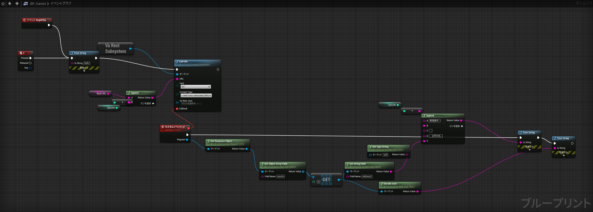
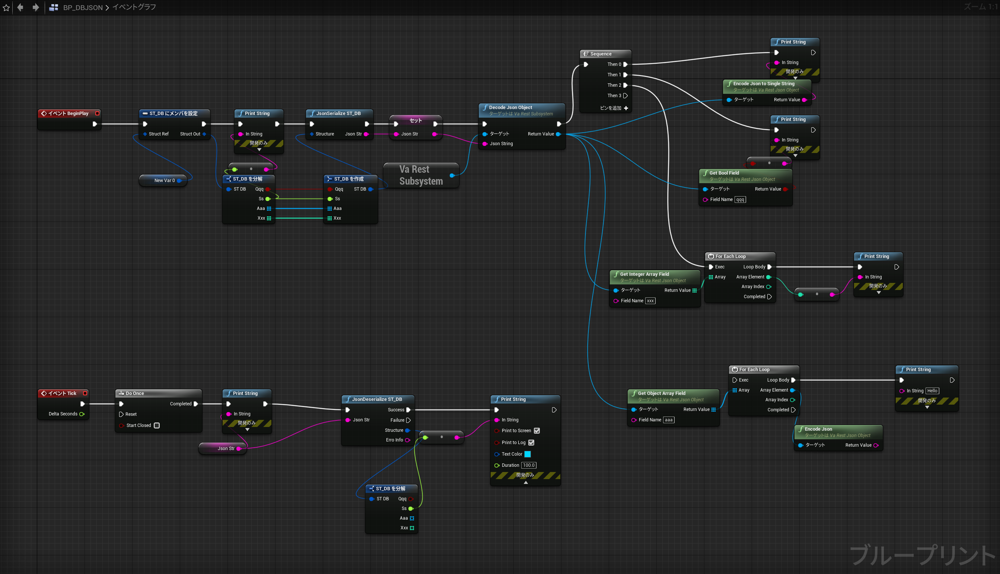

<figure markdown>
  { width="800" }
  <figcaption>VaRest</figcaption>
</figure>

<figure markdown>
  { width="800" }
  <figcaption>DBJSON</figcaption>
</figure>

- [[UE4] Unity出身でもわかる、BluePrintでREST APIを簡単にたたく方法](https://qiita.com/iwaken71/items/a20c095f2c930cf2797c)
- [UE4でBluePrint HTTP REST通信](https://hikoleaf.hatenablog.jp/entry/2020/07/24/181539)