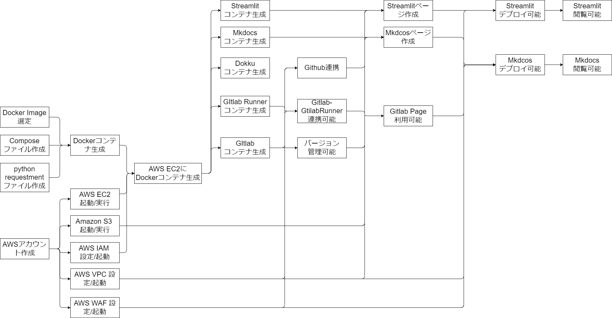

# 夏休みワクワククラウド計画

## はじめに

### やりたいこと

今回のやりたいことは下記の3点。

- Mkdocsで作成した静的サイトのデプロイ
- Streamlitで作成した動的サイトのデプロイ
- Gitlabを用いてバージョン管理

### 使いたいツール

今回、勉強も兼ねて構築をするため、使用したいツールは下記の3点。

| ツール | 対象                        |
| :----- | :-------------------------- |
| AWS    | 環境構築全般                |
| Gitlab | バージョン管理/Gitlab Pages |
| Dokku  | アプリケーションデプロイ    |

### 構成案

上記のやりたいことと使いたいツールから構成案と検討した。

- Developer側（開発時）
    - sshでAWS上のコンテナにアクセスする
    - Gitlabでバージョン管理する
    - バージョン管理データを格納する
    - Gitlab PageにMkdocsをデプロイする
    - dokku上にStreamlitアプリをデプロイする

- User側（閲覧時）
    - Mkdocsのページにアクセスできる
    - Streamlitのパージにアクセスできる
    - httpsを用いて通信できる

図にすると以下のようになる。  
企画段階のため、構成は非常に簡易に作成した。

<figure markdown>
  { width="500" }
  <figcaption>やりたいこと</figcaption>
</figure>

## 機能検討

上記の構成を実現するための機能を検討した。

### 検討結果

下記に費用な機能を洗い出し、対応する技術を出した。

| 機能             | 要求                                                                                                           | 対応する技術  |
| :--------------- | :------------------------------------------------------------------------------------------------------------- | :------------ |
| Userアクセス制限 | 自分だけがアクセスできるようにしたい(開発時/閲覧時)                                                            | AWS IAM / WAF |
| DockerImage使用  | Gitlab構成などをDockerImage上で管理し、コンテナを使用したい   DockerImageはDockerhubにあるImageを使用したい | Amazon EC2    |
| Githubとの連携   | Github上のリポジトリを Gitlab上にクローンしてて使用したい                                                      | Github        |
| データ保存場所   | コンテナから隔離した場所にデータを保存したい                                                                   | Amazon S3     |

## 技術ロードマップ

検討結果を踏まえて習得していく技術の順番を示すロードマップは下記のようになる。コア技術はざっくりDocker関連技術とAWS関連技術となる。

<figure markdown>
  { width="900" }
  <figcaption>やりたいこと</figcaption>
</figure>

### 参考

- [AWSにWEBアプリの最小構成環境を作る](https://qiita.com/okoppe8/items/dc1de147a36797442e4c)
- [【AWS入門】webサーバー構築](https://tech-blog.rakus.co.jp/entry/20211022/aws)
- [0から始めるAWS入門①：VPC編](https://qiita.com/hiroshik1985/items/9de2dd02c9c2f6911f3b)