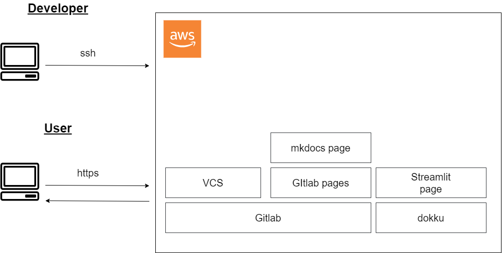

# 夏休みワクワククラウド計画

## はじめに

### やりたいこと

今回のやりたいことは下記の3点。

- Mkdocsで作成した静的サイトのデプロイ
- Streamlitで作成した動的サイトのデプロイ
- Gitlabを用いてバージョン管理

### 使いたいツール

| ツール | 対象                        |
| :----- | :-------------------------- |
| AWS    | 環境構築全般                |
| Gitlab | バージョン管理/Gitlab Pages |
| Dokku  | アプリケーションデプロイ    |

### 構成案

上記のやりたいことと使いたいツールから構成案と検討した。

<figure markdown>
  { width="500" }
  <figcaption>やりたいこと</figcaption>
</figure>

## 機能検討

| 機能             | 要求                                                                                                           | 対応する技術  |
| :--------------- | :------------------------------------------------------------------------------------------------------------- | :------------ |
| Userアクセス制限 | 自分だけがアクセスできるようにしたい(開発時/閲覧時)                                                            | AWS IAM / WAF |
| DockerImage使用  | Gitlab構成などをDockerImage上で管理し、コンテナを使用したい   DockerImageはDockerhubにあるImageを使用したい | Amazon EC2    |
| Githubとの連携   | Github上のリポジトリを Gitlab上にクローンしてて使用したい                                                      | Github        |
| データ保存場所   | コンテナから隔離した場所にデータを保存したい                                                                   | Amazon S3     |

### 参考

- [AWSにWEBアプリの最小構成環境を作る](https://qiita.com/okoppe8/items/dc1de147a36797442e4c)
- [【AWS入門】webサーバー構築](https://tech-blog.rakus.co.jp/entry/20211022/aws)