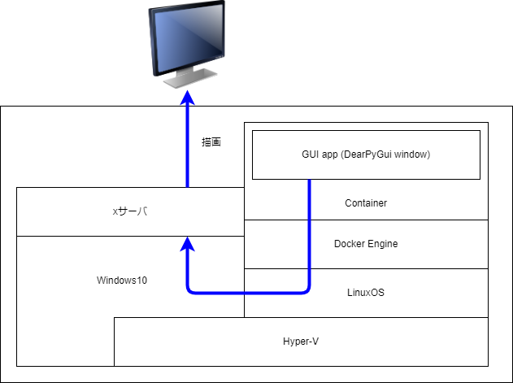

# DearPyGui
PythonのGUIフレームワークの「DearPyGui」について紹介。

## インストール
### 環境構築

以下の構成で構築



* [【サルでも分かる】X11入門](https://www.mtioutput.com/entry/2018/11/08/090000)
* [仕組みと使い方がわかる Docker＆Kubernetesのきほんのきほん](https://book.mynavi.jp/ec/products/detail/id=120304)

### Docker Desktop & x11サーバ(Vcxsrv)
以下を参考にインストール。
* [Docker上のX11GUIをWindowsで使う](https://zenn.dev/dozo/articles/3ef1565b2b069e)


## Dockerコンテナ
### 準備
以下のディレクトリでファイルを準備
```
    docker-compose.yml
    Dockerfile
    requirements.txt
    workspace/

```

#### docker-compose
```yml
version: '3'
services:
  python3:
    restart: always
    build: .
    container_name: 'PythonDearPyGUI'
    working_dir: '/root/'
    tty: true
    volumes:
      - ./workspace:/usr/workspace
      - /tmp/.X11-unix:/tmp/.X11-unix
```

#### Dockerfile
```Dockerfile
FROM python:3.9.10-slim-buster
USER root

RUN apt-get update
RUN apt-get -y install locales && \
    localedef -f UTF-8 -i ja_JP ja_JP.UTF-8
RUN apt-get -y install x11-apps

ENV LANG ja_JP.UTF-8
ENV LANGUAGE ja_JP:ja
ENV LC_ALL ja_JP.UTF-8
ENV TZ JST-9
ENV DISPLAY host.docker.internal:0.0


RUN pip install --upgrade pip
RUN pip install --upgrade setuptools

WORKDIR /usr/src/
COPY requirements.txt  ./
RUN pip install --no-cache-dir -r requirements.txt

```

#### requirements.txt

```txt
dearpygui
```

### コンテナ作成&起動
```
docker-compose up --build
```

https://dearpygui.readthedocs.io/en/latest/tutorials/first-steps.html
https://github.com/hoffstadt/DearPyGui/wiki/


